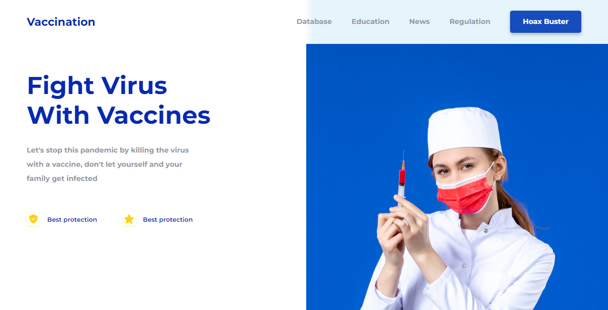
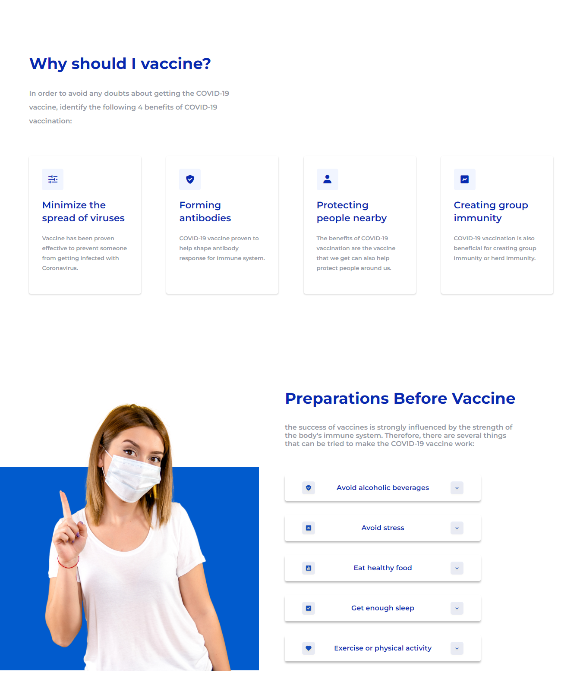
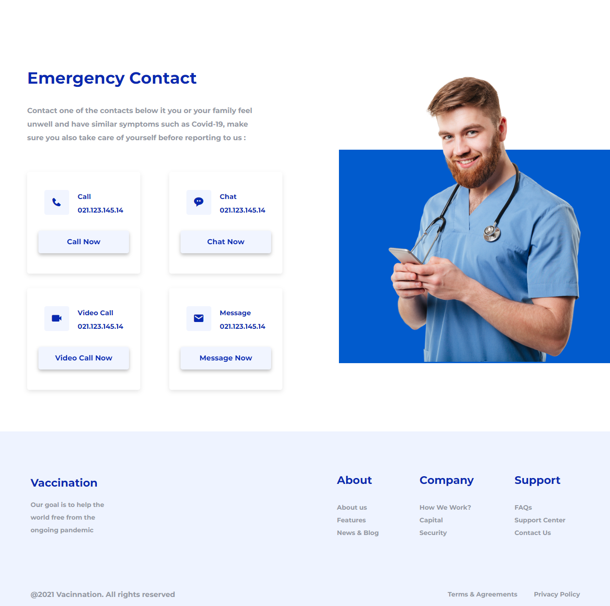

# LaunchX Kata CSS Vacunación
----------
## Esta es mi solución a la kata CSS de la semana 3 de LaunchX

----------
### Primer commit

1. [Resultado](https://jhosiangtz.github.io/LaunchX-Semana-3-CSS/)

2. [Capturas](images/Capturas/)

3. [Diseño UI/UX](images/UI/Resultado%20final.pdf)

## Capturas de pantalla

Pagina de Inicio

Acerca de

Parte final

----------

## Recursos utilizados:

1. [Iconos: BoxIcons](https://boxicons.com/)

2. [Imagenes de stock: FreePick](https://www.freepik.com/)

3. [Tipografía: Montserrat de Google Fonts](https://fonts.google.com/specimen/Montserrat)

4. [Diseño UI/UX](https://dribbble.com/shots/16001939-Vaccination-Vaccine-landing-page-website)